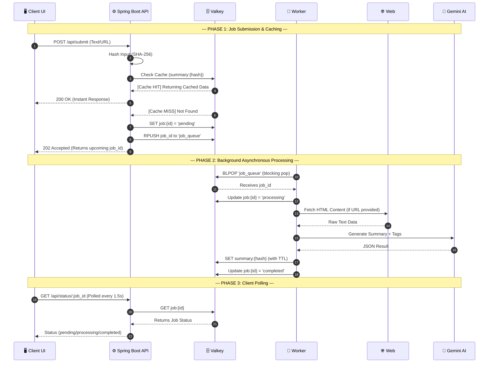

# ⚡ SmartCache AI

> **Async AI Processing & Caching Engine** — Go · Valkey · Gemini · React

A scalable backend system that accepts text/URL inputs, processes them asynchronously through a goroutine worker pool, caches results in Valkey, and generates AI-powered summaries via Gemini.

---

## 🏗️ System Architecture & Core Working



### ⚙️ Core Working Explained

SmartCache AI separates the fast API from slow AI processing using an asynchronous worker pattern:

1. **Deduplication via Hashing**: Every input (whether raw text or a URL) is immediately run through SHA-256 to create a unique fingerprint. This ensures the same article is never processed by the AI twice.
2. **Instant Cache Resolution**: The API checks Valkey for `summary:{hash}`. If the result is already there, it's served instantly (Cache Hit).
3. **Queueing System**: If the summary isn't in Valkey, the API creates a job ticket, pushes the ID to a Valkey list (`job_queue`), and returns a `job_id` to the client. The client then begins polling the status endpoint.
4. **Goroutine Worker Pool**: The backend initializes multiple workers at startup. These workers efficiently block on the queue using `BLPOP`.
5. **AI Processing**: When a worker picks up a job, it handles fetching external URL content if needed, cleans the text, and calls the Google Gemini API.
6. **Result Storage**: The worker saves the final AI output into Valkey under the cached hash key with a TTL, and marks the job ticket as `completed`. The client's next poll returns the fully generated summary.

---

## 🛠️ Tech Stack

| Layer | Technology |
|-------|-----------|
| Backend | Java 17 · Spring Boot 3.4 |
| Cache + Queue | Valkey 8 (Redis-compatible) · Spring Data Redis |
| AI | Google Gemini 1.5 Flash · OkHttp |
| Frontend | React 18 · TypeScript · Vite 5 |

---

## 🚀 Quick Start

### 1. Start Valkey

```bash
docker compose up -d
```

### 2. Configure Backend

```bash
cp backend/.env.example backend/.env
# Edit backend/.env and set your GEMINI_API_KEY
```

### 3. Run Backend

```bash
cd backend
mvn spring-boot:run
```

Backend runs at `http://localhost:8080`

### 4. Run Frontend

```bash
cd frontend
npm install
npm run dev
```

Frontend runs at `http://localhost:5173/` (or `5174/`)

---

## 🔌 API Reference

### `POST /api/submit`
Submit text or a URL for async AI summarization.

```json
// Request
{ "input": "Paste your text or https://example.com/article" }

// Response (cache miss)
{ "job_id": "uuid", "status": "pending", "cached": false }

// Response (cache hit — instant)
{ "job_id": "hash", "status": "completed", "cached": true, "summary": "...", "tags": [] }
```

### `GET /api/status/:job_id`
Poll job status.

```json
{ "job_id": "...", "status": "completed", "summary": "...", "tags": ["AI"], "duration_ms": 1230 }
```

### `GET /api/analytics`
Get system metrics.

```json
{ "total_requests": 42, "cache_hits": 30, "cache_misses": 12, "queue_size": 0, "avg_processing_time_ms": 1240 }
```

### `GET /api/health`
Health check.

---

## 📁 Project Structure

```
smartcache-ai/
├── backend/
│   ├── src/main/java/com/smartcache/
│   │   ├── SmartCacheApplication.java  # Entry point
│   │   ├── config/                     # Spring & CORS config
│   │   ├── model/                      # DTOs & Entities
│   │   ├── cache/                      # Valkey/Redis client
│   │   ├── ai/                         # Gemini integration
│   │   ├── service/                    # Processing logic
│   │   ├── worker/                     # ExecutorService thread pool
│   │   └── controller/                 # REST endoints (Submit, Status, etc)
│   ├── src/main/resources/
│   │   └── application.properties      # Spring properties
│   ├── .env                            # ← Add your GEMINI_API_KEY here
│   ├── .env.example
│   └── pom.xml                         # Maven dependencies
├── frontend/
│   └── src/
│       ├── components/                 # SubmitForm, JobStatus, ResultCard
│       ├── pages/                      # Home, Analytics
│       └── services/api.ts             # Typed API client
└── docker-compose.yml                  # Valkey service
```

---

## ⚙️ Environment Variables

| Variable | Default | Description |
|----------|---------|-------------|
| `GEMINI_API_KEY` | *(required)* | Google AI Studio API key |
| `PORT` | `8080` | Backend port |
| `REDIS_URL` | `redis://localhost:6379` | Valkey connection URL |
| `WORKER_COUNT` | `3` | Number of goroutine workers |
| `CACHE_TTL` | `300` | Summary cache TTL in seconds |

---

## 🔑 Valkey Key Design

| Key Pattern | Purpose |
|------------|---------|
| `summary:{hash}` | Cached AI result |
| `job:{id}` | Job state (pending → processing → completed) |
| `job_queue` | Redis list used as FIFO queue |
| `metrics:*` | Analytics counters |
